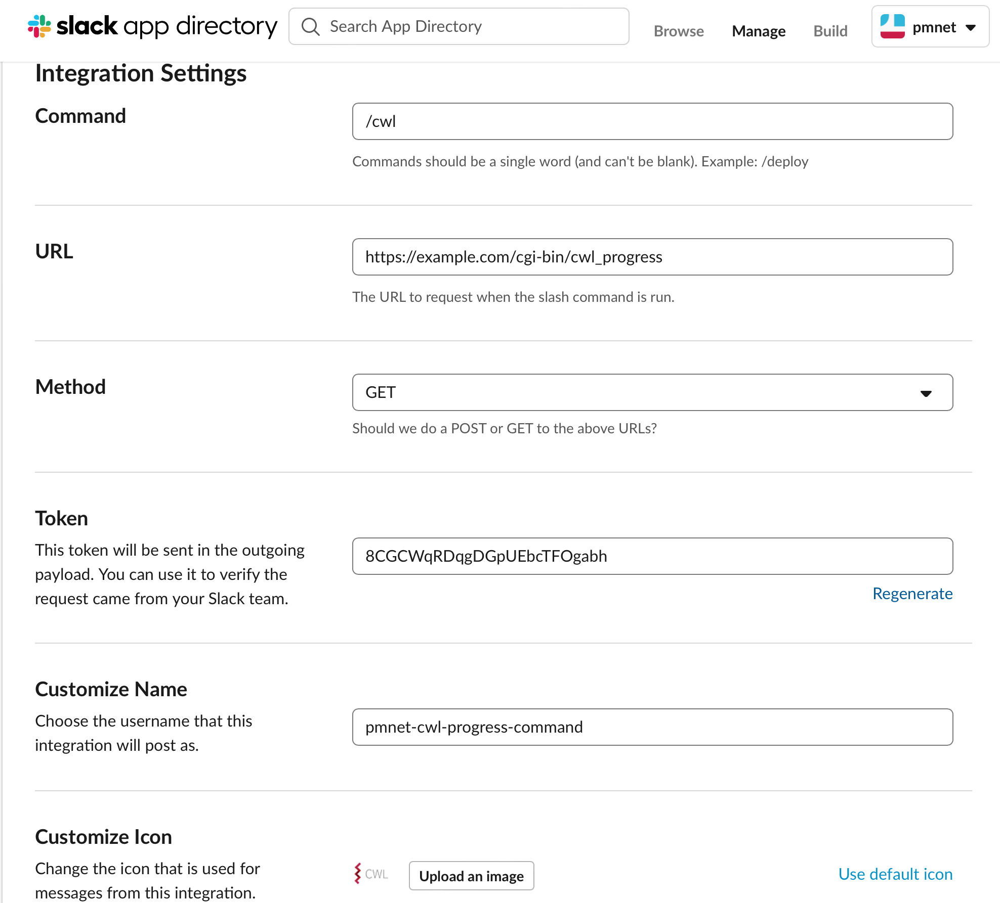

# CWL Progress CGI

A [CGI](https://en.wikipedia.org/wiki/Common_Gateway_Interface) for getting the status of a workflow execution in [Cromwell](https://github.com/broadinstitute/cromwell) using its [REST API](https://cromwell.readthedocs.io/en/stable/api/RESTAPI/#get-workflow-and-call-level-metadata-for-a-specified-workflow)

It is actually meant to be used as a [Slack "slash" command](https://api.slack.com/interactivity/slash-commands) endpoint. After deployment you can create a Slack command and configure it based on the backend server as shown in the figure below




Then in your Slack workspace you can get the status of a given "run id" as follows:
```
/cwl <run-id>
```

## Deployment

You can deploy it e.g. using [Caddy](https://caddyserver.com/v1/docs/http.cgi), or [Apache](https://httpd.apache.org/docs/2.4/howto/cgi.html), or [lighttpd](https://redmine.lighttpd.net/projects/lighttpd/wiki/Docs_ModCGI)
